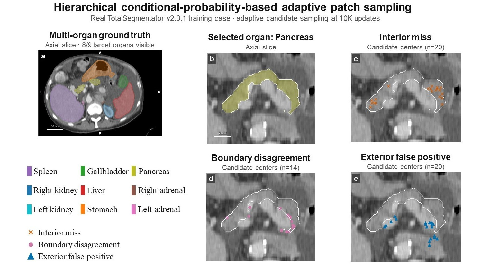
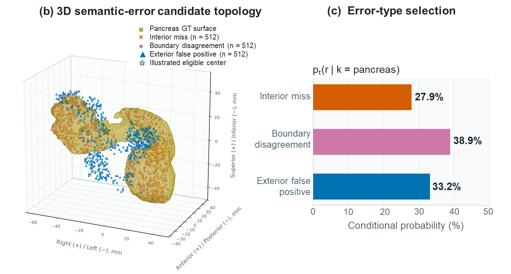
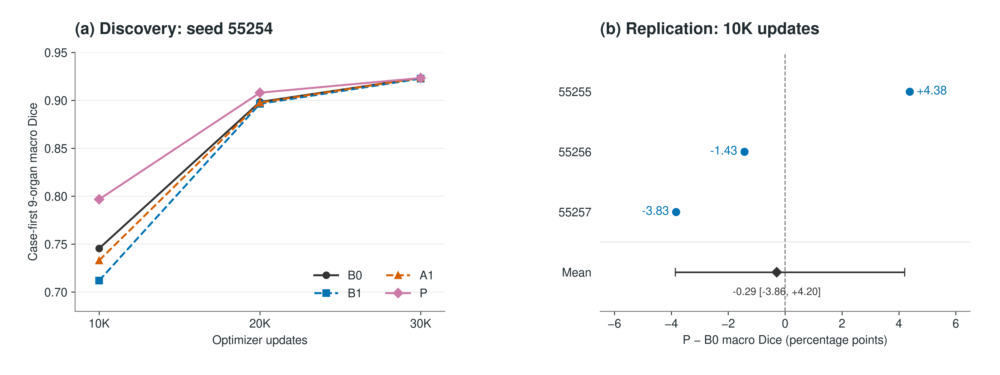

# Hierarchical Patch Sampling for 3D CT

**Organ-wise learning states and semantic error types for adaptive multi-organ segmentation.**

[Manuscript](paper/manuscript_kiit_2026.pdf) · [Results](#results-discovery-and-replication) · [Study notebooks](#study-notebooks)

Yongmin Park (박용민) · Computer Science, Kyonggi University · [Laplace-tech](https://github.com/Laplace-tech)



This project studies **adaptive patch selection for 3D abdominal CT multi-organ segmentation**.
The experimental implementation and saved runs retain the internal name `OLES3D`.
Instead of adding a new backbone, it keeps nnU-Net's segmentation architecture and
changes which training patches the model sees: first select an organ using its
learning state, then an error type, then a candidate patch center.

This sole-author undergraduate project connects medical-image geometry, dataset
auditing, sampler implementation, controlled experiments, and scientific writing.
The public repository presents the manuscript, research figures, aggregate results,
and the scratch notebooks used to build the foundations.

| Data | Task | Comparison | Learning record |
| :--- | :--- | :--- | :--- |
| 602 eligible CT volumes | 9 abdominal organs | B0 / B1 / A1 / P | 20 study notebooks |

## Research question

**Can organ-wise learning states and semantic error types improve learning at a fixed update budget?**

Patch-based training cannot show every part of a 3D CT at every update.
Uniform or foreground-centered sampling does not explicitly distinguish an organ
that is still being missed from a boundary error or a false-positive region.
OLES3D uses those distinctions to allocate patch-sampling probability.

```text
Training-only observations
          │
          ▼
Organ learning state ──► organ k ──► error type r ──► center c ──► 3D patch
                        p(k)         p(r | k)        p(c | k, r)
```

The guided branch factorizes selection as

$$p_t(k,r,c)=p_t(k)\,p_t(r\mid k)\,p_t(c\mid k,r).$$

Organ-wise Dice deficits and observed error-type shares are smoothed over time.
Mixtures of reference and adaptive distributions limit excessive concentration.
Candidate coordinates are sampled within the selected pool. The diagram describes
the guided selection mechanism, not a replacement for the complete nnU-Net pipeline.

| Candidate type | What the model is getting wrong | What the patch targets |
| :--- | :--- | :--- |
| Interior miss | Missed voxels inside the reference organ, away from its boundary | Organ recognition |
| Boundary disagreement | Prediction–label disagreement near the organ surface | Boundary delineation |
| Exterior false positive | That organ predicted outside the reference boundary band | Confusion with surrounding tissue |



*Method illustration from training case `s0004`, pancreas, P / seed 55254 / 10K
updates. Markers show bounded error-candidate reservoirs around the reference
surface, not every erroneous voxel. The highlighted center illustrates patch
selection; it is not a recorded optimizer sample. Surface smoothing is for display.*

## Controlled experiment

| Setting | Configuration |
| :--- | :--- |
| Dataset | TotalSegmentator v2.0.1 |
| Cohort | 602 eligible cases with all nine target masks non-empty |
| Official split retained | 525 train / 28 validation / 49 test |
| Framework | nnU-Net v2.8.1 · `3d_fullres` |
| Spacing / patch / batch | 1.5 mm isotropic / `160 × 112 × 128` / 2 |
| Training budget | 30,000 optimizer updates per run |
| Main metric | Organ macro Dice within each case, then the mean across cases |

Targets: spleen, right/left kidneys, gallbladder, liver, stomach, pancreas,
and right/left adrenal glands. Non-empty labels do **not** establish complete
anatomical coverage. Cohort filtering narrows the population to which results apply.

The comparisons keep the network, preprocessing, loss, augmentation, and update
budget matched while varying sampling. B1/A1/P share the online candidate mechanism.

| Policy | Online error candidates | Organ adaptation | Error-type adaptation |
| :--- | :---: | :---: | :---: |
| **B0** · nnU-Net foreground oversampling | — | — | — |
| **B1** · static candidate allocation | ✓ | — | — |
| **A1** · organ-adaptive allocation | ✓ | ✓ | — |
| **P** · OLES3D | ✓ | ✓ | ✓ |

## Results: discovery and replication



*Left: the four-policy discovery comparison. Right: 10K P − B0 in independent
training seeds; the mean error bar is a paired seed × case bootstrap 95% interval.
All evaluations use the same 28 validation cases.*

**Discovery — seed 55254, 28 validation cases.** All entries below use full-volume
inference, not training-time patch pseudo Dice.

| Policy | 10K Dice | 20K Dice | 30K Dice |
| :--- | ---: | ---: | ---: |
| B0 | 0.745542 | 0.898442 | 0.923552 |
| B1 | 0.711985 | 0.896431 | 0.922776 |
| A1 | 0.733086 | 0.897731 | 0.923548 |
| P | **0.796770** | **0.908046** | 0.923413 |
| P − B0 | **+5.1228 pp** | **+0.9603 pp** | −0.0139 pp |

[Download the discovery table](paper/results/table01_discovery.csv).

The discovery run showed an early advantage that largely disappeared by 30K.
That observation motivated an independent-seed check; it is not, by itself,
evidence of a reliable speedup or final-performance improvement.

**Replication — seeds 55255 / 55256 / 55257, same 28 validation cases.**
At the preselected 10K endpoint, P − B0 was **+4.3806 / −1.4315 / −3.8317 pp**.
The mean was **−0.2942 pp**, with a paired seed × case bootstrap 95% interval of
**[−3.8562, +4.2047] pp**. Only one of three seeds was positive, so the
confirmatory success criterion was **not met**.

The research establishes an implemented and evaluated hierarchical sampling design,
but **does not establish consistent early-learning superiority**. Final Dice,
surface-distance checks, and exploratory held-out results are documented in
[the result tables](#detailed-results), including their limitations.
Wall-clock speedup is not claimed because cloud runtime conditions varied.

<a id="detailed-results"></a>
<details>
<summary>Evaluation details, surface metrics and exploratory test</summary>

These tables summarize saved full-volume evaluation artifacts. They do not use
training-time patch pseudo Dice. Numbers are shown on the Dice 0–1 scale;
**pp** means percentage points, computed as `100 × (P − B0)`.
Publication export: 2026-09-30. No models were retrained for this export.

### Experimental scope

TotalSegmentator v2.0.1 was filtered to 602 eligible cases with non-empty masks for
all nine target organs. The official split roles were retained: 525 train, 28
validation, 49 test. Patient independence beyond those official split assignments
was not independently established. Eligibility does not guarantee complete organ
coverage or represent every field of view in the original 1,228-case release.

Each case contributes the mean of its nine organ Dice scores, and cases are then
averaged with equal weight. For repeated-seed summaries, those case-first means
are averaged across seeds. A non-empty ground truth with an empty prediction has
Dice zero.

| Stage | Seeds | Policies | Full-volume evaluation checkpoints |
| :--- | :--- | :--- | :--- |
| Discovery | 55254 | B0, B1, A1, P | 10K / 20K / 30K |
| Replication | 55255, 55256 | B0, B1, A1, P | 5K / 10K / 15K / 20K / 25K / 30K |
| Additional replication | 55257 | B0, P only | 5K / 10K / 15K / 20K / 25K / 30K |
| Post-primary exploratory test | 55254, 55255 | B0, P only | 10K / 30K |

The B0/P replication summary below uses **all three** replication seeds.
Seed 55254 is discovery and is excluded from that primary summary.

### Independent replication: the primary check

At 10K updates on the same 28 validation cases:

| Replication seed | P − B0 (pp) |
| :--- | ---: |
| 55255 | +4.3806 |
| 55256 | −1.4315 |
| 55257 | −3.8317 |
| **Mean** | **−0.2942** |

The mean Dice was **0.786975 for B0** and **0.784033 for P**.
The paired seed × case percentile-bootstrap 95% interval for P − B0 was
**[−3.8562, +4.2047] pp** (100,000 resamples).
The prespecified criterion required positive differences in all replication seeds
and a positive lower confidence bound. It was **not met**.
Three seeds provide limited precision for seed-level uncertainty; resampling
patients/cases does not create additional independent training runs.

[All six checkpoints and per-seed differences (CSV)](paper/results/table02_replication.csv).

### Surface checks at 30K

Discovery seed 55254; 28 validation cases; technical NSD tolerance 3 mm.
This tolerance is not a clinical acceptability threshold.

| Policy | NSD @ 3 mm ↑ | HD95 (mm) ↓ | Empty predictions / 252 case–organ pairs |
| :--- | ---: | ---: | ---: |
| B0 | 0.965922 | 4.667 | 1 |
| B1 | 0.966945 | 6.053 | 0 |
| A1 | 0.965281 | 6.921 | 0 |
| P | 0.964456 | 6.121 | 1 |

NSD is zero for an empty prediction; its HD95 is undefined, not zero.
HD95 summaries average available organs within each case and then across cases.
Missing entries and different availability therefore matter: subtraction of these
displayed means is **not** the paired common-nonempty-organ contrast.
The audit does not support a final surface-quality superiority claim.

[Unrounded surface summaries (CSV)](paper/results/table04_surface_metrics.csv).

### Held-out test: explicitly exploratory

49 held-out cases, evaluated **after** the failed validation primary using the
selected seeds 55254 and 55255. These are not a new random sample of training seeds;
55254 is the discovery seed. Seed selection and post-primary analysis prevent this
result from replacing the failed confirmatory check.

| Updates | B0 mean Dice | P mean Dice | P − B0 (pp) | Bootstrap 95% CI (pp) |
| :--- | ---: | ---: | ---: | :--- |
| 10K | 0.705304 | 0.767734 | +6.2430 | [+4.4458, +8.2161] |
| 30K | 0.905157 | 0.906698 | +0.1541 | [−0.3884, +0.6086] |

The intervals describe variability within this two-seed, 49-case evaluation;
they do not account for the preceding seed-selection decision.
[Unrounded test summaries (CSV)](paper/results/table03_exploratory_test.csv).

### Interpretation and release scope

- The contribution is an implemented, evaluated hierarchical organ/error-type
  sampling design and its controlled comparison with nnU-Net sampling.
- The discovery run and selected-seed test show early gains, but independent-seed
  replication does not establish a consistent improvement.
- The experiment does not demonstrate final-Dice superiority, clinical benefit,
  formal equivalence, or robust wall-clock savings. Cloud host variability makes
  cross-host runtime claims inappropriate.
- The manuscript focuses on the discovery comparison; this companion includes
  the broader replication and exploratory-test evidence so that the public
  overview is not limited to the favorable run.

The [source manifest](paper/results/source_manifest.json) records local source-artifact names and
SHA-256 hashes for the exported aggregate numbers. Source artifacts and research
implementation are not included in the public tree. These hashes document
provenance; they are not a substitute for a full reproducibility release.

The [overview figure](paper/figures/fig03_learning_dynamics.png) is also available as an
[editable vector SVG](paper/figures/fig03_learning_dynamics.svg). The CT and 3D method figures
are supplied manuscript assets derived from TotalSegmentator, not synthetic
generative images. The illustrated training case is `s0004`; error candidates
come from a bounded observer snapshot and need not represent all voxel errors
at a single simultaneous prediction time.

</details>

## Study notebooks

The study archive follows the data flow of a segmentation system, from Tensor
contracts to physical-space evaluation and nnU-Net's training pipeline.

| Part | Focus | Notebooks |
| :--- | :--- | ---: |
| [1 · Segmentation fundamentals](studies/prerequisites/part01_segmentation_fundamentals) | Tensor contracts, softmax, cross-entropy, Dice / IoU | 3 |
| [2 · U-Net from scratch](studies/prerequisites/part02_unet_from_scratch) | Convolution, skip connections, tiny overfit | 3 |
| [3 · Volumetric learning](studies/prerequisites/part03_volumetric_learning) | Conv3D memory, patch sampling, sliding-window inference | 3 |
| [4 · Medical-image geometry](studies/prerequisites/part04_medical_image_geometry_ct) | NIfTI, affine, orientation, resampling, CT windowing | 4 |
| [5 · Losses & evaluation](studies/prerequisites/part05_losses_physical_space_evaluation) | Soft Dice, surface metrics, empty masks, case aggregation | 3 |
| [6 · nnU-Net literacy](studies/prerequisites/part06_nnunet_v2_literacy) | Fingerprints, planning, oversampling, deep supervision | 3 |
| [7 · Research hygiene](studies/prerequisites/part07_research_hygiene_statistics) | Splits, leakage, reproducibility | 1 |

<details>
<summary>Full notebook index · 20 lessons</summary>

| Part / Lesson | Notebook | Cells | 난도 | 복습의 핵심 |
| --- | --- | ---: | --- | --- |
| 1.1 | [Tensor Contract](studies/prerequisites/part01_segmentation_fundamentals/01_tensor_contracts.ipynb) | 5 | ██░░░ | input·logits·target·prediction Shape |
| 1.2 | [Softmax & Cross-Entropy](studies/prerequisites/part01_segmentation_fundamentals/02_softmax_cross_entropy.ipynb) | 5 | ███░░ | 수치 안정성과 voxel-wise loss |
| 1.3 | [Dice & IoU](studies/prerequisites/part01_segmentation_fundamentals/03_dice_iou.ipynb) | 5 | ███░░ | TP/FP/FN·overlap·empty masks |
| 2.1 | [Convolution & Receptive Field](studies/prerequisites/part02_unet_from_scratch/01_convolution_shapes.ipynb) | 6 | ███░░ | convolution Shape·receptive field 계산 |
| 2.2 | [Encoder–Decoder & Skip](studies/prerequisites/part02_unet_from_scratch/02_encoder_decoder_skip.ipynb) | 5 | ███░░ | down/up sampling·feature 결합 |
| 2.3 | [Minimal U-Net & Tiny Overfit](studies/prerequisites/part02_unet_from_scratch/03_minimal_2d_unet_tiny_overfit.ipynb) | 6 | ████░ | 작은 synthetic data의 end-to-end 학습 |
| 3.1 | [Conv3D & Memory](studies/prerequisites/part03_volumetric_learning/01_conv3d_tensor_flow_memory.ipynb) | 6 | ███░░ | 3D activation·학습 peak memory |
| 3.2 | [Crop, Padding & Sampling](studies/prerequisites/part03_volumetric_learning/02_crop_padding_patch_sampling.ipynb) | 6 | ███░░ | patch 경계·uniform/foreground center |
| 3.3 | [Sliding-Window Inference](studies/prerequisites/part03_volumetric_learning/03_sliding_window_inference.ipynb) | 5 | ████░ | overlap accumulation·normalization |
| 4.1 | [NIfTI Array & Affine](studies/prerequisites/part04_medical_image_geometry_ct/01_nifti_array_affine.ipynb) | 5 | ███░░ | voxel index에서 physical coordinate로 변환 |
| 4.2 | [Orientation & Three-Plane Viewing](studies/prerequisites/part04_medical_image_geometry_ct/02_orientation_three_plane_viewing.ipynb) | 5 | ███░░ | array 축·방향·canonical RAS |
| 4.3 | [Spacing-Aware Resampling](studies/prerequisites/part04_medical_image_geometry_ct/03_spacing_aware_resampling.ipynb) | 5 | ██░░░ | Shape·spacing·image/label interpolation |
| 4.4 | [CT HU, Windowing & Anatomy](studies/prerequisites/part04_medical_image_geometry_ct/04_ct_hu_windowing_abdominal_anatomy.ipynb) | 6 | ███░░ | intensity·laterality·partial FOV |
| 5.1 | [Cross-Entropy + Soft Dice](studies/prerequisites/part05_losses_physical_space_evaluation/01_cross_entropy_soft_dice.ipynb) | 6 | ██░░░ | loss 결합·gradient 확인 |
| 5.2 | [Surface Distance, NSD & HD95](studies/prerequisites/part05_losses_physical_space_evaluation/02_surface_distance_nsd_hd95.ipynb) | 6 | ████░ | surface distance·mm tolerance |
| 5.3 | [Empty Masks & Case Aggregation](studies/prerequisites/part05_losses_physical_space_evaluation/03_empty_masks_case_aggregation.ipynb) | 5 | ███░░ | 예외 처리·case/class 집계 순서 |
| 6.1 | [Fingerprint, Plans & Preprocessing](studies/prerequisites/part06_nnunet_v2_literacy/01_dataset_fingerprint_plans_preprocessing.ipynb) | 6 | ████░ | nnU-Net planning·preprocessing flow |
| 6.2 | [Default Foreground Oversampling](studies/prerequisites/part06_nnunet_v2_literacy/02_default_foreground_oversampling.ipynb) | 6 | ███░░ | case·foreground·class·center 선택 |
| 6.3 | [Deep Supervision & Predictor](studies/prerequisites/part06_nnunet_v2_literacy/03_deep_supervision_predictor.ipynb) | 6 | ████░ | multi-scale Tensor·inference flow |
| 7.1 | [Split, Leakage & Reproducibility](studies/prerequisites/part07_research_hygiene_statistics/01_split_leakage_reproducible_runs.ipynb) | 6 | ██░░░ | statistical unit·manifest·seed |

</details>

The notebooks are educational implementations, not the experiment runners.
Open a notebook, install its imports in your own Python environment, and run cells
from top to bottom. CUDA-memory exercises require a CUDA-capable GPU. Saved kernel
names describe the original workstation and may need to be reselected elsewhere.

The archive contains 111 non-empty code cells. A static check found no syntax errors
or saved exceptions; nine cells in Parts 1–3 have no execution count. This is not a
claim that every notebook has been rerun or that educational examples validate
performance on patient data.

## Manuscript & repository scope

**Hierarchical Conditional-Probability-Based Adaptive Patch Sampling with
Organ-Wise Learning States and Error Types for 3D Abdominal CT Multi-Organ Segmentation**

*3차원 복부 CT 다장기 분할을 위한 계층적 조건부 확률 기반의 장기별 학습 상태 및 오류 유형 적응형 패치 샘플링*

[Read the manuscript (PDF)](paper/manuscript_kiit_2026.pdf)
— prepared for KIIT 2026 Fall. This repository labels it as a manuscript;
acceptance, publication, or an award is not asserted here.

```text
hierarchical-patch-sampling-3d/
├── README.md                Research overview, results, notebook index
├── paper/
│   ├── manuscript_kiit_2026.pdf
│   ├── figures/             fig01–fig03: method and experimental results
│   └── results/             table01–table04: aggregate CSVs and source hashes
└── studies/prerequisites/   20 educational notebooks
```

**Published code is limited to `studies/`.** Training/evaluation implementation,
infrastructure scripts, raw CT/masks, checkpoints, and internal reports are not
included in the current public tree. This is a research portfolio and study archive,
not a complete experiment-reproduction release. No clinical-use claim is made.

The work builds on [TotalSegmentator](https://github.com/wasserth/TotalSegmentator)
and [nnU-Net](https://github.com/MIC-DKFZ/nnUNet).
The dataset release is [TotalSegmentator v2.0.1](https://doi.org/10.5281/zenodo.10047292)
(CC BY 4.0); the displayed medical-image figures are derived from that dataset.
Full references appear in the manuscript.
