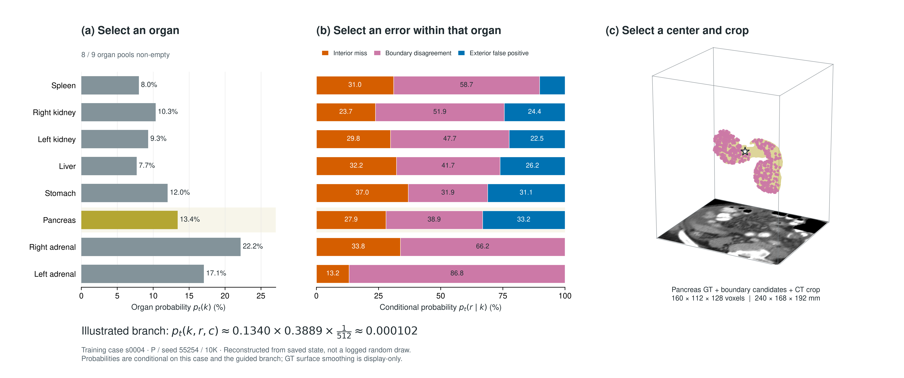

# Hierarchical Conditional-Probability-Based Adaptive Patch Sampling

*Organ-Wise Learning States and Error Types for 3D Abdominal CT Multi-Organ Segmentation*

## Overview

Adaptive patch sampling for **3D abdominal CT multi-organ segmentation**, guided by organ-wise learning states and prediction error types. The nnU-Net architecture remains unchanged.

## Method

The guided sampling branch follows a **hierarchical conditional-probability structure**: select an organ $k$, an error type $r$ conditioned on that organ, and a patch center $c$ from the corresponding candidate pool.

$$
p_t(k,r,c) = p_t(k)\,p_t(r \mid k)\,p_t(c \mid k,r)
$$

Organ selection uses a smoothed Dice deficit; error-type selection combines current
candidate counts with historical error shares. A 3D patch is cropped around the
selected center. These probabilities describe the guided branch, not every patch.

<details>
<summary>🔢 (Click) Sampling equations · learning states and conditional distributions</summary>

For the current training case, $K_t$ contains organs with candidates,
$R_t(k)$ contains their non-empty error types, and $C_t(k,r)$ is a candidate pool.
States are updated from training-only observer patches, not validation labels.

**1. Organ learning state and selection**

Let $D_k^{(t)}$ be the observed hard Dice for organ $k$. Its deficit is smoothed
with an exponential moving average (EMA):

$$e_t(k)=1-D_k^{(t)},\qquad d_t(k)=\beta d_{t-1}(k)+(1-\beta)e_t(k).$$

$$p_t(k)=\frac{1-\lambda_k}{|K_t|}+\lambda_k\frac{d_t(k)}{\sum_{j\in K_t}d_t(j)}.$$

Here $\beta=0.9$ and $\lambda_k=0.5$. The uniform component keeps each eligible
organ selectable: $p_t(k)\geq(1-\lambda_k)/|K_t|$.

**2. Error type conditioned on the selected organ**

$$b_t(r\mid k)=\frac{|C_t(k,r)|}{\sum_{r'\in R_t(k)}|C_t(k,r')|}.$$

$$p_t(r\mid k)=(1-\lambda_r)b_t(r\mid k)+\lambda_r a_t(r\mid k).$$

$a_t(r\mid k)$ is the EMA of observed error-type shares, renormalized over
available types; $\lambda_r=0.5$. Those shares use raw observer error counts,
whereas $b_t$ uses bounded candidate-pool counts.

**3. Center conditioned on organ and error type**

$$p_t(c\mid k,r)=\frac{1}{|C_t(k,r)|},\qquad c\in C_t(k,r).$$

Each EMA starts from its first valid observation. Both-empty Dice observations
are skipped. Zero total organ difficulty falls back to uniform selection;
unavailable error-state mass falls back to the candidate-count distribution.
The hierarchy and mixtures follow the manuscript; the probability lower bound
above is a direct consequence, not an additional method.

</details>

| Candidate type | What the model is getting wrong | What the patch targets |
| :--- | :--- | :--- |
| Interior miss | Missed voxels inside the reference organ, away from its boundary | Organ recognition |
| Boundary disagreement | Prediction–label disagreement near the organ surface | Boundary delineation |
| Exterior false positive | That organ predicted outside the reference boundary band | Confusion with surrounding tissue |


*Training case `s0004` · pancreas · P / seed 55254 / 10K updates.*
Markers show bounded candidate reservoirs, not every error. The highlighted center
is illustrative, not a recorded training draw; surface smoothing is for display.

### From conditional probabilities to a 3D patch



The saved state links eight eligible organs to their error-type distributions and
an illustrative pancreas-centered crop; the gallbladder pool is empty in this snapshot.
These are sampling probabilities, not prediction confidence.

## Experimental setup

| Setting | Configuration |
| :--- | :--- |
| Dataset | TotalSegmentator v2.0.1 |
| Cohort | 602 eligible cases with all nine target masks non-empty |
| Official split retained | 525 train / 28 validation / 49 test |
| Framework | nnU-Net v2.8.1 · `3d_fullres` |
| Spacing / patch / batch | 1.5 mm isotropic / `160 × 112 × 128` / 2 |
| Training budget | 30,000 optimizer updates per run |
| Main metric | Organ macro Dice within each case, then the mean across cases |

Targets: spleen, right/left kidneys, gallbladder, liver, stomach, pancreas,
and right/left adrenal glands. Non-empty labels do **not** establish complete
anatomical coverage. Cohort filtering narrows the population to which results apply.

The comparisons keep the network, preprocessing, loss, augmentation, and update
budget matched while varying sampling. B1/A1/P share the online candidate mechanism.

| Policy | Online error candidates | Organ adaptation | Error-type adaptation |
| :--- | :---: | :---: | :---: |
| **B0** · nnU-Net foreground oversampling | — | — | — |
| **B1** · static candidate allocation | ✓ | — | — |
| **A1** · organ-adaptive allocation | ✓ | ✓ | — |
| **P** · hierarchical conditional sampling | ✓ | ✓ | ✓ |

For policy $m$ at update $u$, case-first macro Dice and the P–B0 difference are

$$
S_m(u)=\frac{1}{N}\sum_{i=1}^{N}
\left(\frac{1}{9}\sum_{k=1}^{9}\mathrm{Dice}_{i,k}^{(m,u)}\right),
$$

$$
\Delta_{\mathrm{pp}}(u)=100\left[S_P(u)-S_{B0}(u)\right].
$$

Each case and organ has equal weight. These are full-volume evaluation scores,
distinct from the observer-patch Dice used for sampling.

## Results


*Left: the four-policy discovery comparison. Right: 10K P − B0 in independent
training seeds; the mean error bar is a paired seed × case bootstrap 95% interval.
All evaluations use the same 28 validation cases.*

### Discovery: early improvement in one seed

Seed **55254**, **28 validation cases**.

| Policy | 10K Dice | 20K Dice | 30K Dice |
| :--- | ---: | ---: | ---: |
| B0 | 0.745542 | 0.898442 | 0.923552 |
| B1 | 0.711985 | 0.896431 | 0.922776 |
| A1 | 0.733086 | 0.897731 | 0.923548 |
| P | **0.796770** | **0.908046** | 0.923413 |
| P − B0 | **+5.1228 pp** | **+0.9603 pp** | −0.0139 pp |

The early P–B0 difference narrowed at 20K and was nearly absent at 30K.

### Replication: the improvement was not consistent

The primary check compared P and B0 at **10K updates** in three independent training
seeds, using the same 28 validation cases.

| Seed | P − B0 Dice (pp) |
| :--- | ---: |
| 55255 | +4.3806 |
| 55256 | −1.4315 |
| 55257 | −3.8317 |
| **Mean** | **−0.2942** |

The mean difference had a paired seed × case bootstrap 95% interval of
**[−3.8562, +4.2047] pp**. Only one seed was positive: the confirmatory criterion
was **not met**.

**The experiments do not establish consistent early-learning or final-performance
superiority.** Wall-clock speedup is not claimed because cloud runtime conditions varied.

<details>
<summary>Evaluation details, surface metrics and exploratory test</summary>

Exported from saved evaluations on 2026-09-30; no retraining for this release.

### Experimental scope

Patient independence beyond the official split was not independently established.
The filtered cohort does not represent every field of view in the 1,228-case release.
Repeated-seed summaries weight seeds equally. An empty prediction against a
non-empty reference mask has Dice zero.

| Stage | Seeds | Policies | Full-volume evaluation checkpoints |
| :--- | :--- | :--- | :--- |
| Discovery | 55254 | B0, B1, A1, P | 10K / 20K / 30K |
| Replication | 55255, 55256 | B0, B1, A1, P | 5K / 10K / 15K / 20K / 25K / 30K |
| Additional replication | 55257 | B0, P only | 5K / 10K / 15K / 20K / 25K / 30K |
| Post-primary exploratory test | 55254, 55255 | B0, P only | 10K / 30K |

### Primary check and uncertainty

All three replication seeds enter the primary summary; discovery seed 55254 does not.
At 10K, mean Dice was **0.786975 for B0** and **0.784033 for P**.
The criterion required positive differences in every replication seed and a positive
lower confidence bound. The paired seed × case percentile bootstrap used 100,000
resamples. Three seeds still give limited seed-level precision; resampling cases
does not create additional training runs.

### Surface checks at 30K

Discovery seed 55254; 28 validation cases; technical NSD tolerance 3 mm.
This tolerance is not a clinical acceptability threshold.

| Policy | NSD @ 3 mm ↑ | HD95 (mm) ↓ | Empty predictions / 252 case–organ pairs |
| :--- | ---: | ---: | ---: |
| B0 | 0.965922 | 4.667 | 1 |
| B1 | 0.966945 | 6.053 | 0 |
| A1 | 0.965281 | 6.921 | 0 |
| P | 0.964456 | 6.121 | 1 |

NSD is zero for an empty prediction; its HD95 is undefined, not zero.
HD95 summaries average available organs within each case and then across cases.
Missing entries and different availability therefore matter: subtraction of these
displayed means is **not** the paired common-nonempty-organ contrast.
The audit does not support a final surface-quality superiority claim.

### Held-out test: explicitly exploratory

49 held-out cases, evaluated **after** the failed validation primary using the
selected seeds 55254 and 55255. These are not a new random sample of training seeds;
55254 is the discovery seed. Seed selection and post-primary analysis prevent this
result from replacing the failed confirmatory check.

| Updates | B0 mean Dice | P mean Dice | P − B0 (pp) | Bootstrap 95% CI (pp) |
| :--- | ---: | ---: | ---: | :--- |
| 10K | 0.705304 | 0.767734 | +6.2430 | [+4.4458, +8.2161] |
| 30K | 0.905157 | 0.906698 | +0.1541 | [−0.3884, +0.6086] |

The intervals describe variability within this two-seed, 49-case evaluation;
they do not account for the preceding seed-selection decision.

### Evidence and release scope

The manuscript focuses on the discovery comparison; this repository also includes
replication and exploratory-test evidence. Neither clinical benefit nor formal
equivalence is established.

The source manifest records source-artifact names and SHA-256 hashes for the
aggregate numbers, not a full reproduction package.

The supplied CT/3D figures derive from TotalSegmentator, not generative images.
Candidate snapshots may combine observations from different refresh times.

</details>

## Conference & Academic Output

**Hierarchical Conditional-Probability-Based Adaptive Patch Sampling with Organ-Wise Learning States and Error Types for 3D Abdominal CT Multi-Organ Segmentation**

*3차원 복부 CT 다장기 분할을 위한 계층적 조건부 확률 기반의 장기별 학습 상태 및 오류 유형 적응형 패치 샘플링*

[Read the manuscript (PDF)](paper/manuscript_kiit_2026.pdf)

| Item | Details |
| --- | --- |
| Conference | 2026 한국정보기술학회 추계종합학술대회 · 대학생논문경진대회 |
| Research Area | Deep Learning · Medical AI · Medical Image Segmentation |
| Author | 박용민 (**First Author**) |
| Email | add28482848@kyonggi.ac.kr |
| Affiliation | 경기대학교 AI컴퓨터공학부 |


## Repository scope

```text
hierarchical-patch-sampling-3d/
├── README.md                Method, experimental setup, results
├── paper/
│   ├── manuscript_kiit_2026.pdf
│   ├── figures/             fig01–fig04: method and experimental results
│   └── results/             Aggregate CSVs, sampling probabilities, source hashes
└── studies/prerequisites/   20 educational notebooks
```

The work uses [TotalSegmentator v2.0.1](https://doi.org/10.5281/zenodo.10047292)
(CC BY 4.0) and [nnU-Net](https://github.com/MIC-DKFZ/nnUNet).
Medical-image figures derive from that dataset; full references are in the manuscript.
