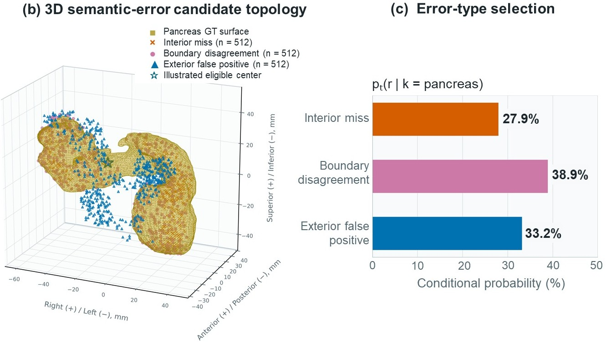
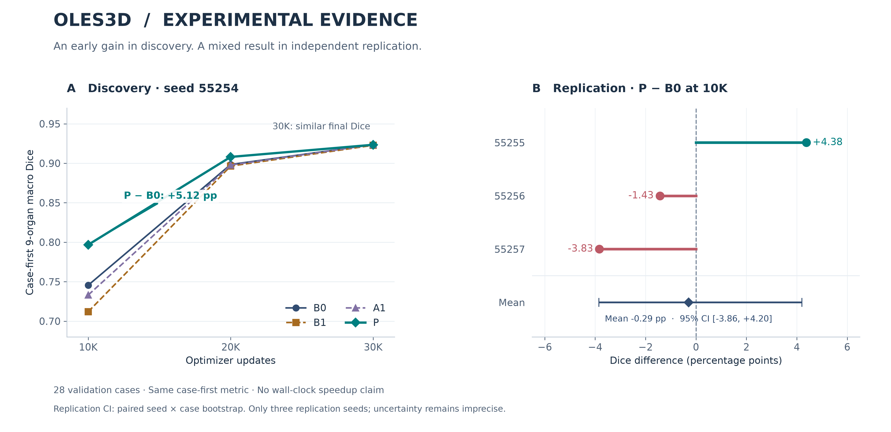

<div align="center">

# OLES3D

### Organ-wise learning states. Error-aware patch sampling.

**A research project on how a 3D segmentation model chooses what to learn next.**

[Manuscript](<paper/2026_KIIT_추계(대학생)_박용민_논문.hwp.pdf>) · [Results & limitations](paper/RESULTS.md) · [Study notebooks](studies/prerequisites/README.md)

Yongmin Park (박용민) · Computer Science, Kyonggi University · [Laplace-tech](https://github.com/Laplace-tech)

</div>

.jpg>)

OLES3D studies **adaptive patch selection for 3D abdominal CT multi-organ segmentation**.
Instead of adding a new backbone, it keeps nnU-Net's segmentation architecture and
changes which training patches the model sees: first select an organ using its
learning state, then an error type, then a candidate patch center.

This sole-author undergraduate project connects medical-image geometry, dataset
auditing, sampler implementation, controlled experiments, and scientific writing.
The public repository presents the manuscript, research figures, aggregate results,
and the scratch notebooks used to build the foundations.

| Data | Task | Comparison | Learning record |
| :--- | :--- | :--- | :--- |
| 602 eligible CT volumes | 9 abdominal organs | B0 / B1 / A1 / P | 20 study notebooks |

## Research question

**Can organ-wise learning states and semantic error types improve learning at a fixed update budget?**

Patch-based training cannot show every part of a 3D CT at every update.
Uniform or foreground-centered sampling does not explicitly distinguish an organ
that is still being missed from a boundary error or a false-positive region.
OLES3D uses those distinctions to allocate patch-sampling probability.

```text
Training-only observations
          │
          ▼
Organ learning state ──► organ k ──► error type r ──► center c ──► 3D patch
                        p(k)         p(r | k)        p(c | k, r)
```

The guided branch factorizes selection as

$$p_t(k,r,c)=p_t(k)\,p_t(r\mid k)\,p_t(c\mid k,r).$$

Organ-wise Dice deficits and observed error-type shares are smoothed over time.
Mixtures of reference and adaptive distributions limit excessive concentration.
Candidate coordinates are sampled within the selected pool. The diagram describes
the guided selection mechanism, not a replacement for the complete nnU-Net pipeline.

| Candidate type | What the model is getting wrong | What the patch targets |
| :--- | :--- | :--- |
| Interior miss | Missed voxels inside the reference organ, away from its boundary | Organ recognition |
| Boundary disagreement | Prediction–label disagreement near the organ surface | Boundary delineation |
| Exterior false positive | That organ predicted outside the reference boundary band | Confusion with surrounding tissue |



*Method illustration from training case `s0004`, pancreas, P / seed 55254 / 10K
updates. Markers show bounded error-candidate reservoirs around the reference
surface, not every erroneous voxel. The highlighted center illustrates patch
selection; it is not a recorded optimizer sample. Surface smoothing is for display.*

## Controlled experiment

| Setting | Configuration |
| :--- | :--- |
| Dataset | TotalSegmentator v2.0.1 |
| Cohort | 602 eligible cases with all nine target masks non-empty |
| Official split retained | 525 train / 28 validation / 49 test |
| Framework | nnU-Net v2.8.1 · `3d_fullres` |
| Spacing / patch / batch | 1.5 mm isotropic / `160 × 112 × 128` / 2 |
| Training budget | 30,000 optimizer updates per run |
| Main metric | Organ macro Dice within each case, then the mean across cases |

Targets: spleen, right/left kidneys, gallbladder, liver, stomach, pancreas,
and right/left adrenal glands. Non-empty labels do **not** establish complete
anatomical coverage. Cohort filtering narrows the population to which results apply.

The comparisons keep the network, preprocessing, loss, augmentation, and update
budget matched while varying sampling. B1/A1/P share the online candidate mechanism.

| Policy | Online error candidates | Organ adaptation | Error-type adaptation |
| :--- | :---: | :---: | :---: |
| **B0** · nnU-Net foreground oversampling | — | — | — |
| **B1** · static candidate allocation | ✓ | — | — |
| **A1** · organ-adaptive allocation | ✓ | ✓ | — |
| **P** · OLES3D | ✓ | ✓ | ✓ |

## Results: discovery and replication



**Discovery — seed 55254, 28 validation cases.** All entries below use full-volume
inference, not training-time patch pseudo Dice.

| Policy | 10K Dice | 20K Dice | 30K Dice |
| :--- | ---: | ---: | ---: |
| B0 | 0.745542 | 0.898442 | 0.923552 |
| B1 | 0.711985 | 0.896431 | 0.922776 |
| A1 | 0.733086 | 0.897731 | 0.923548 |
| P | **0.796770** | **0.908046** | 0.923413 |
| P − B0 | **+5.1228 pp** | **+0.9603 pp** | −0.0139 pp |

The discovery run showed an early advantage that largely disappeared by 30K.
That observation motivated an independent-seed check; it is not, by itself,
evidence of a reliable speedup or final-performance improvement.

**Replication — seeds 55255 / 55256 / 55257, same 28 validation cases.**
At the preselected 10K endpoint, P − B0 was **+4.3806 / −1.4315 / −3.8317 pp**.
The mean was **−0.2942 pp**, with a paired seed × case bootstrap 95% interval of
**[−3.8562, +4.2047] pp**. Only one of three seeds was positive, so the
confirmatory success criterion was **not met**.

The research establishes an implemented and evaluated hierarchical sampling design,
but **does not establish consistent early-learning superiority**. Final Dice,
surface-distance checks, and exploratory held-out results are documented in
[the result tables](paper/RESULTS.md), including their limitations.
Wall-clock speedup is not claimed because cloud runtime conditions varied.

## From fundamentals to research

The study archive follows the data flow of a segmentation system, from Tensor
contracts to physical-space evaluation and nnU-Net's training pipeline.

| Part | Focus | Notebooks |
| :--- | :--- | ---: |
| [1 · Segmentation fundamentals](studies/prerequisites/part01_segmentation_fundamentals) | Tensor contracts, softmax, cross-entropy, Dice / IoU | 3 |
| [2 · U-Net from scratch](studies/prerequisites/part02_unet_from_scratch) | Convolution, skip connections, tiny overfit | 3 |
| [3 · Volumetric learning](studies/prerequisites/part03_volumetric_learning) | Conv3D memory, patch sampling, sliding-window inference | 3 |
| [4 · Medical-image geometry](studies/prerequisites/part04_medical_image_geometry_ct) | NIfTI, affine, orientation, resampling, CT windowing | 4 |
| [5 · Losses & evaluation](studies/prerequisites/part05_losses_physical_space_evaluation) | Soft Dice, surface metrics, empty masks, case aggregation | 3 |
| [6 · nnU-Net literacy](studies/prerequisites/part06_nnunet_v2_literacy) | Fingerprints, planning, oversampling, deep supervision | 3 |
| [7 · Research hygiene](studies/prerequisites/part07_research_hygiene_statistics) | Splits, leakage, reproducibility | 1 |

[Open the full study index →](studies/prerequisites/README.md)
The notebooks are educational implementations, not the OLES3D experiment runners.

## Manuscript & repository scope

**Hierarchical Conditional-Probability-Based Adaptive Patch Sampling with
Organ-Wise Learning States and Error Types for 3D Abdominal CT Multi-Organ Segmentation**

*3차원 복부 CT 다장기 분할을 위한 계층적 조건부 확률 기반의 장기별 학습 상태 및 오류 유형 적응형 패치 샘플링*

[Read the manuscript (PDF)](<paper/2026_KIIT_추계(대학생)_박용민_논문.hwp.pdf>)
— prepared for KIIT 2026 Fall. This repository labels it as a manuscript;
acceptance, publication, or an award is not asserted here.

```text
oles3d/
├── README.md                Research overview
├── paper/                   Manuscript, method figures, result tables
│   └── assets/              Evidence plot, aggregate CSVs, source hashes
└── studies/prerequisites/   20 educational notebooks and study index
```

**Published code is limited to `studies/`.** Training/evaluation implementation,
infrastructure scripts, raw CT/masks, checkpoints, and internal reports are not
included in the current public tree. This is a research portfolio and study archive,
not a complete experiment-reproduction release. No clinical-use claim is made.

The work builds on [TotalSegmentator](https://github.com/wasserth/TotalSegmentator)
and [nnU-Net](https://github.com/MIC-DKFZ/nnUNet).
The dataset release is [TotalSegmentator v2.0.1](https://doi.org/10.5281/zenodo.10047292)
(CC BY 4.0); the displayed medical-image figures are derived from that dataset.
Full references appear in the manuscript.
